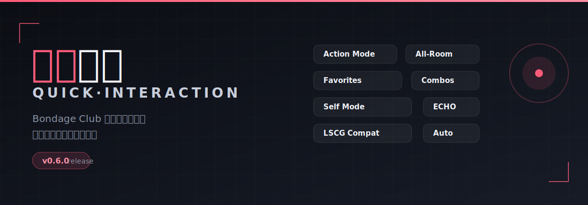

# 快捷互动 · QuickInteraction

> Bondage Club 动作快捷操作台：点击角色身体部位，直接选择动作执行。

[](https://github.com/heitaoplay/QuickInteraction/commits)
[](LICENSE)
[](https://raw.githubusercontent.com/heitaoplay/QuickInteraction/main/loader.user.js)

点击上方 **Install** 按钮，Tampermonkey 会自动弹出安装提示。装好后刷新 BC 页面即可使用，**以后每次刷新都会自动更新到最新版**。

---

## 功能

- **点部位选动作**：进入动作模式后，点击角色身上的高亮部位，直接弹出该部位可用动作列表
- **一键全员**：对房间内所有其他成员同时执行当前动作
- **自己模式**：自己的身体也会出现热区，可对自己执行动作
- **收藏**：把常用动作标星，下次快速找到
- **自定义组合**：把多个部位动作存成连招，一键依次执行
- **主题切换**：深色 / 浅色主题一键切换，偏好随账号保存
- **社区兼容**：兼容 ECHO、LSCG、Liko-Prank 等社区动作扩展

---

## 安装

1. 浏览器安装 [Tampermonkey](https://www.tampermonkey.net/)
2. 点击上方 **Install** 按钮，在弹出的安装提示里点「安装」
3. 进入 BC 聊天室，刷新页面，右下角出现闪电开关即安装成功

> ⚠️ 如果之前装过完整版 `quick-interaction.user.js`，建议先在油猴里删除，避免重复加载。

---

## 其他方式（无需 Tampermonkey）

不想装脚本管理器，也可以直接在 BC 页面加载：

### 控制台安装
1. 在 BC 聊天室页面按 `F12` 打开开发者工具，切到 **Console（控制台）** 标签
2. 粘贴下面一行并回车：

```js
var s=document.createElement('script');s.src='https://heitaoplay.github.io/QuickInteraction/assets/main.js?v='+Date.now();document.head.appendChild(s);
```

3. 右下角出现闪电开关即成功（**每次刷新页面需重新粘贴一次**）

### 书签安装
1. 右键书签栏 → 新建书签，名称填「快捷互动」
2. 网址填下面整行：

```
javascript:(function(){var s=document.createElement('script');s.src='https://heitaoplay.github.io/QuickInteraction/assets/main.js?v='+Date.now();document.head.appendChild(s);})();
```

3. 以后进入 BC 聊天室，点一下这个书签即可加载（**同样每次刷新需重点**）

> 💡 控制台和书签方式每次刷新都要重新执行一次。想「刷新即自动更新」还是推荐上面的 Tampermonkey 安装。

---

## 使用

1. 进入 BC 聊天室
2. 点击右下角闪电按钮，进入「动作模式」
3. 点击人物身上的高亮部位 → 选择动作 → 执行
4. 底部按钮可切换：自己 / 全员 / 收藏 / 组合动作
5. 标题栏的太阳 / 月亮按钮切换深色 / 浅色主题

---

## 常见问题

**Q：装完没反应？**  
A：确认 Tampermonkey 已启用本脚本，且你正处于 BC 聊天室页面，刷新一次即可。

**Q：为什么有的动作点了没效果？**  
A：动作能否执行由游戏判定（目标是否穿着对应物品、是否被拘束等），脚本只负责发送动作请求。

**Q：换电脑后设置还在吗？**  
A：收藏、组合、主题等设置会写入游戏账号并同步到服务器，换设备登录同一账号即可恢复。

---

## 更新日志

### v0.7.9
- 两人拥抱时线框自动避让，避免重叠
- 闪电按钮支持拖动位置
- 名字浮层精确对齐游戏内角色名字

### v0.7.4
- 修复子部位动作翻译键缺失，列表不再漏动作，聊天不再出现 `MISSING`

### v0.7.3
- 修复主题切换面板无变化的问题

### v0.7.2
- 主题系统简化为深色 / 浅色两套

### v0.7.0
- 设置写入游戏账号并跨设备同步

更早版本见 [docs/review.md](docs/review.md)。

---

## 开发

- 代码规范：[docs/code-standards.md](docs/code-standards.md)
- 质量审查：[docs/review.md](docs/review.md)
- 欢迎提 Issue 与 Pull Request

## 作者

- **作者**：Tao MUSE
- **技术支持**：[Liko](https://github.com/awdrrawd)
- 反馈请走 [Issues](https://github.com/heitaoplay/QuickInteraction/issues)

## 许可证

[MIT](LICENSE) © 2026 Tao MUSE
